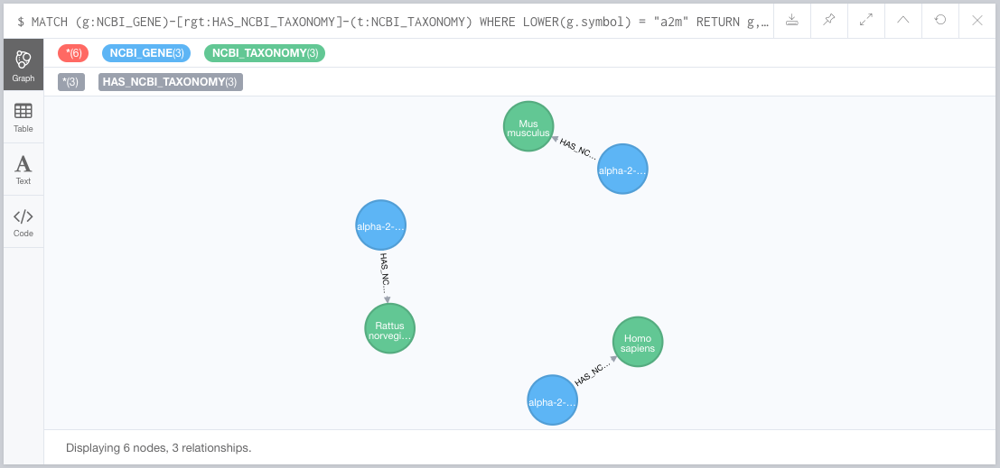

# biological-graph-database

Graph Database Infrastructure for Biological Applications (particularly molecular biology applications)

This is basically where I am collecting all my Neo4j code for making general purpose biological graph databases. I've found this infrastructure useful on multiple occasions.

## Example result



## How to run this thing

You need a lot of memory...

```
mkdir output
mkdir output/gene_lists
mkdir data

cd data
mkdir taxonomy
cd taxonomy
wget ftp://ftp.ncbi.nlm.nih.gov/pub/taxonomy/taxdump.tar.gz
gunzip taxdump.tar.gz 
tar -xf taxdump.tar 
gzip taxdump.tar 
cd ..
cd ..

cd data
mkdir gene
cd gene
wget ftp://ftp.ncbi.nlm.nih.gov/gene/DATA/gene_info.gz
wget ftp://ftp.ncbi.nlm.nih.gov/gene/DATA/gene2go.gz
wget ftp://ftp.ncbi.nlm.nih.gov/gene/DATA/gene2pubmed.gz
gunzip gene_info.gz
gunzip gene2go.gz
gunzip gene2pubmed.gz
cd ..
cd ..

cd data
mkdir DisGeNET
cd DisGeNET
wget http://www.disgenet.org/static/disgenet_ap1/files/current/disgenet_2018.db.gz
gunzip disgenet_2018.db.gz
cat ../../DisGeNET.sql | sqlite3 disgenet_2018.db > relevant_db_dump.tsv
cat ../../DisGeNET_part_02.sql | sqlite3 disgenet_2018.db > relevant_db_dump_DISEASE_NAMES.tsv
gzip disgenet_2018.db
cd ..
cd ..

$NEO4J_HOME/bin/neo4j start

python3 load_taxonomy.py --hostname localhost --username neo4j --password a-not-too-serious-password --limit-taxonomies-to 9606,10090,10116

python3 preprocess_gene_info.py --limit-taxonomies-to 9606,10090,10116

python3 load_gene.py --hostname localhost --username neo4j --password a-not-too-serious-password

python3 load_and_link_synonyms.py --hostname localhost --username neo4j --password a-not-too-serious-password

python3 link_genes_to_taxonomy.py --hostname localhost --username neo4j --password a-not-too-serious-password

python3 load_gene_to_pubmed.py --hostname localhost --username neo4j --password a-not-too-serious-password --limit-taxonomies-to 9606,10090,10116

python3 load_gene_to_go.py --hostname localhost --username neo4j --password a-not-too-serious-password --limit-taxonomies-to 9606,10090,10116
```

## Running the code I created for a Harvard Medical School demonstration

```
cd project_for_Harvard_Medical_School__Kevin/

python3 code_for_Kevin.py --hostname localhost --username neo4j --password a-not-too-serious-password

python3 directly_link_genes_to_diseases.py --hostname localhost --username neo4j --password a-not-too-serious-password

python3 directly_link_genes_to_each_other_weighted_by_diseases.py --hostname localhost --username neo4j --password a-not-too-serious-password

cd ..
```

## Useful queries

### Boring queries

Find the taxonomy node for human:

```
MATCH (c:NCBI_TAXONOMY) WHERE c.id = 9606 RETURN c;
```
Find the taxonomy node for human, which specific attributes:
```
MATCH (c:NCBI_TAXONOMY) WHERE c.id = 9606 RETURN c.id AS NCBI_taxonomy_id, c.name AS scientific_name;
```

Find the NCBI gene synonym node 'A1B':
```
MATCH (n:NCBI_GENE_SYNONYM) WHERE n.symbol = "A1B" RETURN n;
```

### Slightly more interesting queries

Show taxonomy (should be 9606--human) and gene synonyms for human gene A1BG:
```
MATCH (g:NCBI_GENE)-[r1:HAS_NCBI_TAXONOMY]->(t:NCBI_TAXONOMY), (g)-[r2:HAS_NCBI_GENE_SYNONYM]->(gs:NCBI_GENE_SYNONYM), (gs)-[r3:HAS_NCBI_TAXONOMY]->(t) WHERE g.id = 1 RETURN g, r1, t, r2, gs, r3;
```

### Much more interesting queries

Show the genes and gene ontology terms connected with diseases.
```
MATCH (d:HMS_DISEASE)-[rg:INVOLVES_NCBI_GENE]->(g:NCBI_GENE)-[rgo:HAS_GENE_ONTOLOGY]->(go:GENE_ONTOLOGY) RETURN d, rg, g, rgo, go LIMIT 500;
```
